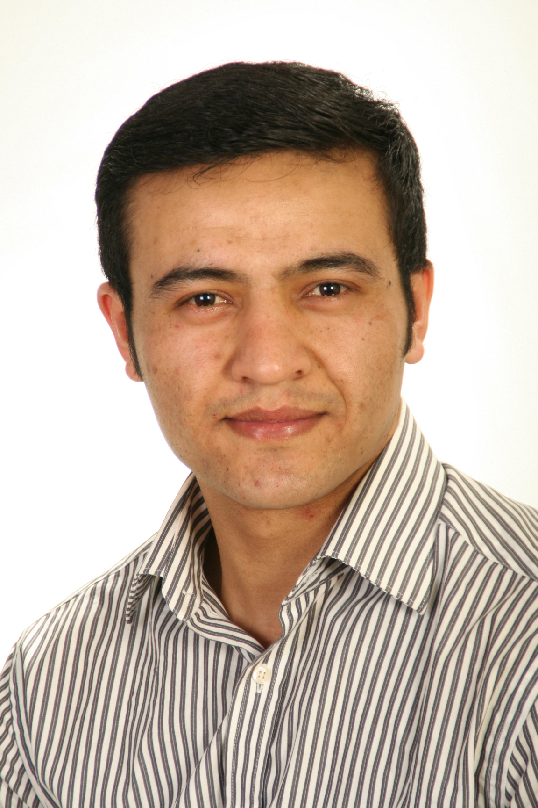

```{r, include=FALSE}
knitr::opts_chunk$set(
  results='asis', 
  echo = FALSE,
  warning = FALSE,
  message = FALSE
)

library(magrittr) # For the pipe
source("cv_printing_functions.r")

# Read in all data and initialize a CV printer object
CV <- create_CV_object(
  data_location = "https://docs.google.com/spreadsheets/d/1aQMhkLKx9MayoMaLvI4aBR2bk0Ad-3MampihWa2A4kA",  
  pdf_mode = params$pdf_mode
)

```


```{r}
# When in pdf export mode the little dots are unaligned, so fix that with some conditional CSS.
if(params$pdf_mode) {
    cat("
<style>
:root{
  --decorator-outer-offset-left: -6.5px;
}
</style>")
}
```


Aside
================================================================================

```{r}
# Build interactive network of positions colored by section
# and connected if they occurred in the same year
# datadrivencv::build_network_logo(CV$entries_data)

```


```{r}
# if(params$pdf_mode){
#   cat("View this CV online with links at _C:/Users/sultanov/Documents/cv-sultanov_")
# } else {
#   cat("[<i class='fas fa-download'></i> Download a PDF of this CV](C:/Users/sultanov/Documents/cv-sultanov/cv.pdf)")
# }
# cat("[<i class='fas fa-download'></i> Download a PDF](C:/Users/sultanov/Documents/cv-sultanov/cv.pdf){.external target='_blank'}")
```

Contact {#contact}
--------------------------------------------------------------------------------

::: aside_cont

```{r}
CV %>% print_contact_info()
```
:::

Language Skills {#lang_skills}
--------------------------------------------------------------------------------

```{r}
CV %>% print_lang_skill_bars()
```

It-Skills {#it_skills}
--------------------------------------------------------------------------------

```{r}
CV %>% print_it_skill_bars()
```


Main
================================================================================

Fazliddin Sultonov {#title}
--------------------------------------------------------------------------------

::: header_intro

```{r}
# Note the special double pipe so we modify the CV object in place
CV %<>% print_text_block("intro")
```
:::

Work Experience {data-icon=user-tie}
--------------------------------------------------------------------------------

```{r}
CV %<>% print_section('work')
```


<br>
<br>
<br>

Upskilling {data-icon=user-gear data-concise=true}
--------------------------------------------------------------------------------

```{r}
CV %<>% print_section('adv_educ')
```

::: aside_fot

---
```{r}
# Note the special double pipe so we modify the CV object in place
CV %<>% print_text_block("foot")
```
:::

<br>
<br>

Academic Education {data-icon=user-graduate data-concise=true}
--------------------------------------------------------------------------------

```{r}
CV %<>% print_section('education')
```

<br>
<br>

School Education {data-icon=book-open-reader data-concise=true}
--------------------------------------------------------------------------------

```{r}
CV %<>% print_section('school')
```

<br>
<br>

Disclaimer {#disclaimer}
--------------------------------------------------------------------------------
Made with the R package <br>[**pagedown**](https://github.com/rstudio/pagedown) and [**datadrivencv**](https://nickstrayer.me/datadrivencv/) <br> by [*Nick Strayer*](https://nickstrayer.me/).

Last updated on `r Sys.Date()`.


